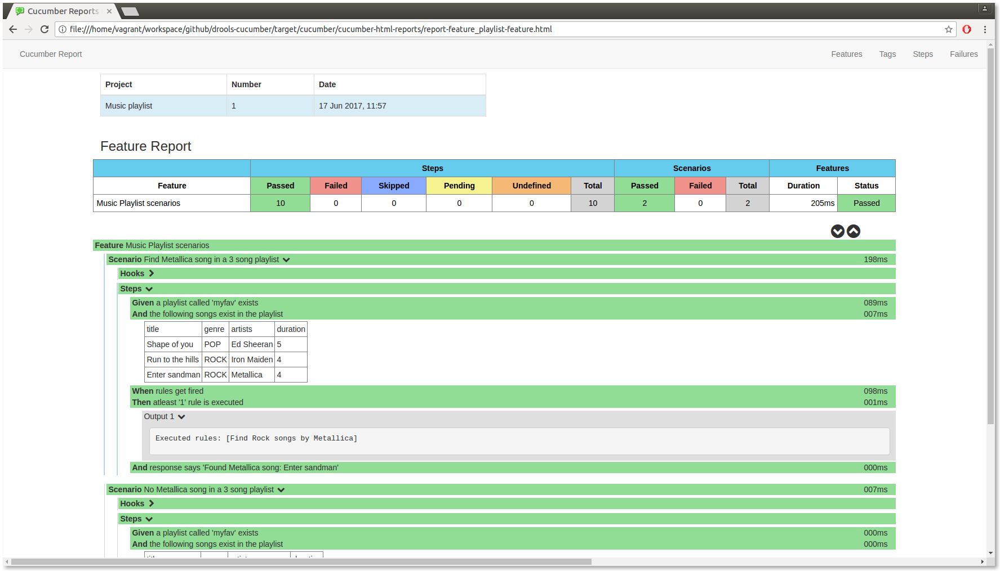

# Drools Business Driven testing using Cucumber
This project shows Business driven testing of Drools using Cucumber as the BDD test framework

# Version
- JDK 8
- Maven: 3.x
- Spring: 4.3.x
- Drools: 6.5.0.Final
- _drools-support-0.0.1_ module

# Background
## Components
- _DRL file_: src/mian/resources/playlist/playlist-rules.drl
- _Cucumber feature file_: src/test/features/playlist.feature
- _Playlist domain package_: playlist 

## Test steps
1. Create a playlist of songs
2. Rules are written to identify and report a specific song
3. Write test scenarios in the cucumber feature file
4. Create step executions
5. Run Cucumber test

The test will print out the rule(s) fired with execution stats. A cucumber report is generated as well.
  

# Run tests
- Download this project and _drools-support_
- ``mvn clean install`` on _drools-support_
- ``mvn clean package`` on this project
- Tests get executed and a report will be generated at _target/cucumber/cucumber-html-reports_
- Optionally you may use the [Jenkins Cucumber plugin](https://wiki.jenkins-ci.org/display/JENKINS/Cucumber+Reports+Plugin) to generate the report and remove the cucumber report plugin from the POM
- Test report after execution:

# Reference
- [Drools Support](https://github.com/anair-it/drools-support)
- [Cucumber](https://cucumber.io/docs)
- [Cucumber reporting](https://github.com/damianszczepanik/maven-cucumber-reporting)
